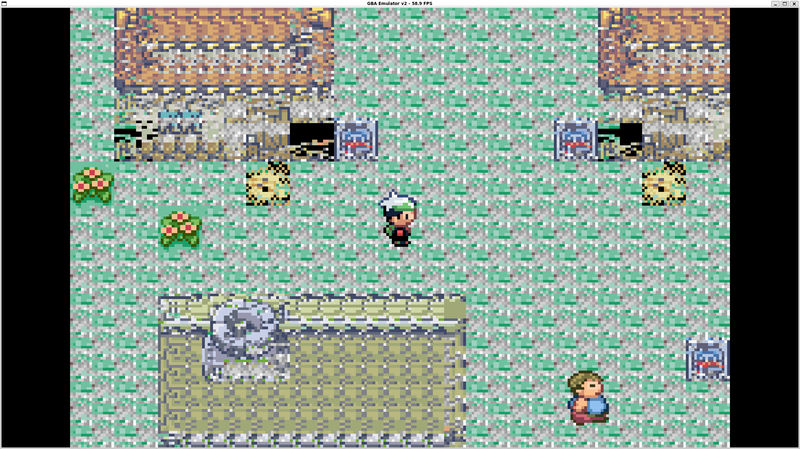
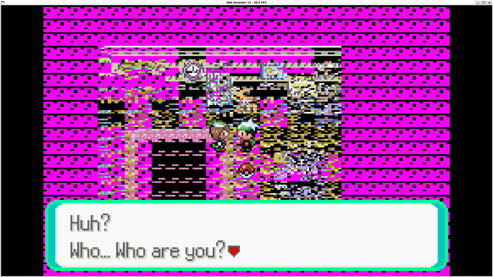
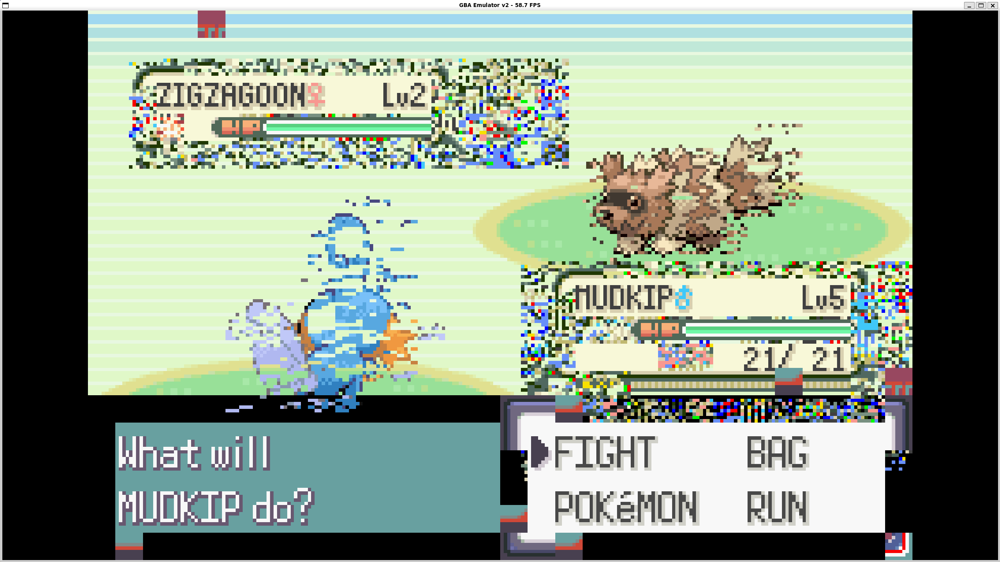

# GBA Emulator

A Game Boy Advance emulator.




## Build

```bash
sudo apt install libsdl2-dev
mkdir build && cd build
cmake .. -DCMAKE_BUILD_TYPE=Release
make -j$(nproc)
```

## Run

```bash
./build/gba_emu path/to/rom.gba
```

## Controls

| Key | Button |
|-----|--------|
| Arrow keys | D-pad |
| X | A |
| Z | B |
| Enter | Start |
| Right Shift | Select |
| A | L |
| S | R |
| Tab | Turbo |
| F5 | Save |

(Need to fix sprite rendering to get this to work fully)