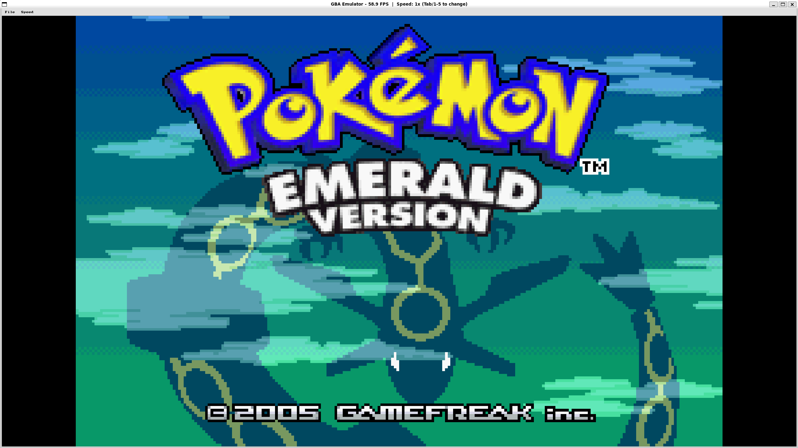
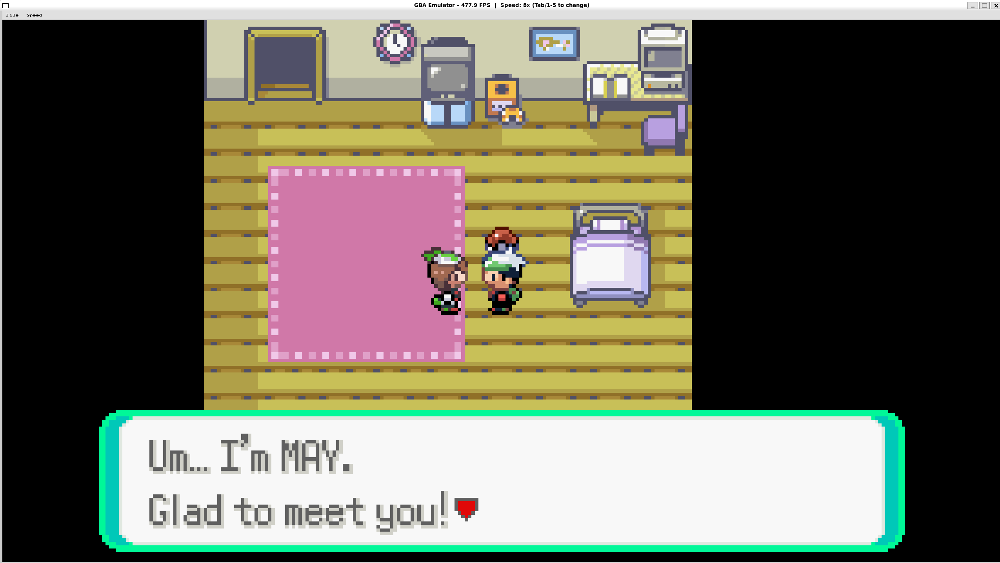
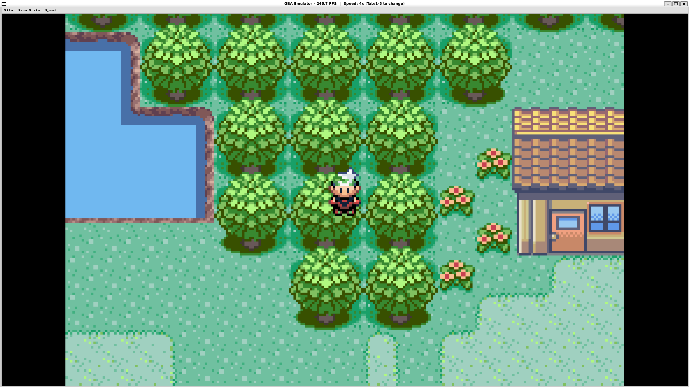

# GBA Emulator

Game Boy Advance emulator.






## Components

- **ARM7TDMI CPU**: ARM and Thumb instruction sets
- **PPU**:background modes 0-2, affine backgrounds, sprites, blending, windowing
- **APU**: 4 PSG channels (square, wave, noise) + 2 DMA FIFO channels
- **DMA**:4 DMA channels with HBlank, VBlank, and FIFO triggers
- **Timers**: 4 cascading timers with overflow interrupts
- **Interrupts**: VBlank, HBlank, VCount, timer, DMA
- **Memory bus**: ROM, EWRAM, IWRAM, VRAM, OAM, palette RAM, I/O
- **Save support**: Flash 128K save emulation
- **Sound**: SDL2 audio output
- **RTC**: real-time clock
- **Cheats**: Gameshark cheats support

## Speed Controls

Use the menu bar at the top of the window or keyboard shortcuts:

| Key | Action |
|-----|--------|
| Tab | Cycle through speed options |
| 1 | 1x (normal) |
| 2 | 2x |
| 3 | 4x |
| 4 | 8x |
| 5 | Unlimited |

## Gameshark Cheats

Any Gameshark cheat is supported. There are many gameshark cheats that you can use to make the game easier, harder, game breaking, etc. Be careful using these since it could courrupt your save if used.

## Requirements

- C++20
- SDL2
- Linux

## Build

```bash
sudo apt install libsdl2-dev
mkdir build && cd build
cmake .. -DCMAKE_BUILD_TYPE=Release
make -j$(nproc)
```

## Run

```bash
./build/gba_emu path/to/rom.gba
```

## Controls

| Key | Button |
|-----|--------|
| Arrow keys | D-pad |
| X | A |
| Z | B |
| Enter | Start |
| Right Shift | Select |
| A | L |
| S | R |
| Tab | Turbo |
| F5 | Save |